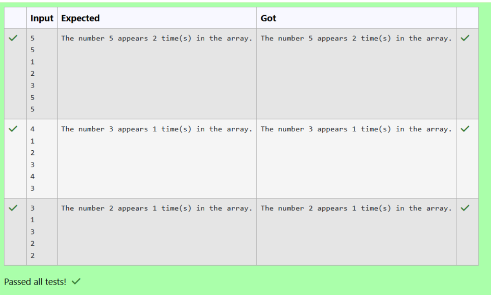

# Ex2 Count how many times a number appears in an array recursively.
## DATE: 16-09-2026
## AIM:
To write a Java program to Count how many times a number appears in an array recursively.

## Algorithm
1. Read the size of the array and its elements.
2. Read the number to be searched.
3. Create a recursive method countOccurrences() with the array, target number, and index.
4. If the index reaches the end of the array, return 0.
5. Recursively count occurrences from the next index.
6. If the current element equals the target number, add 1 to the recursive result.
7. Return the total count.
8. Display how many times the number appears.  

## Program:
```
/*
Program Count how many times a number appears in an array recursively.
Developed by: HARIPRASHAAD RA
RegisterNumber:  212223040060
*/
```

```java

import java.util.Scanner;

public class CountOccurrences {
    public static int countOccurrences(int[] arr, int n, int target) {
        if (n == 0) {
            return 0;
        }
        if (arr[n - 1] == target) {
            return 1 + countOccurrences(arr, n - 1, target);
        } else {
            return countOccurrences(arr, n - 1, target);
        }
    }

    public static void main(String[] args) {
        Scanner scanner = new Scanner(System.in);
        int size = scanner.nextInt();

        if (size <= 0) {
            System.out.println("Invalid array size. Must be positive.");
            return;
        }

        int[] arr = new int[size];
        for (int i = 0; i < size; i++) {
            arr[i] = scanner.nextInt();
        }

        // Input: Target number to count
        int target = scanner.nextInt();

        int count = countOccurrences(arr, size, target);
        System.out.println("The number " + target + " appears " + count + " time(s) in the array.");

        scanner.close();
    }
}

```

## Output:





## Result:
Thus, the Java program to Count how many times a number appears in an array recursively is implemented successfully.
